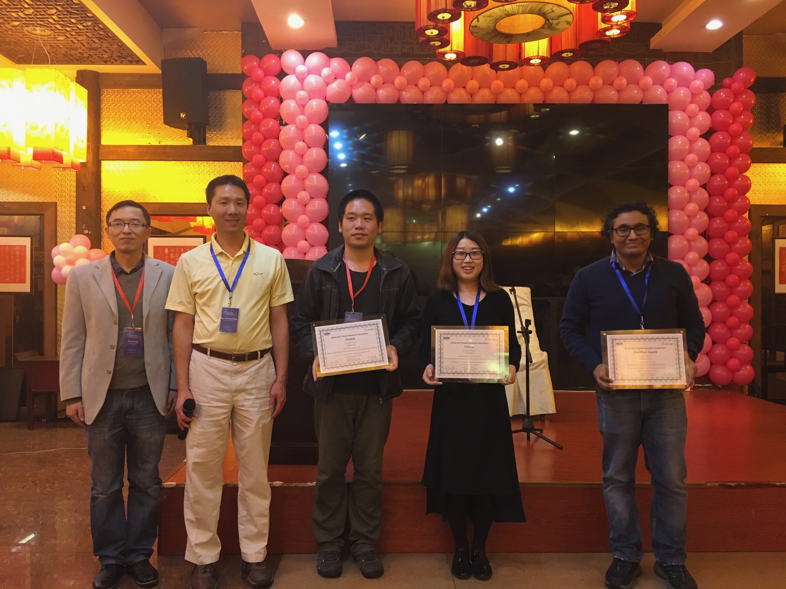

# Student Research Competition

## Overview
This year APLAS will host a Student Research Competition where students 
can present posters. The Competition consists of three rounds:

1) Extended abstract round: Participants submit an extended abstract 
outlining their research results. Please follow the submission 
requirements of [posters](posters.html).

2) Poster session at APLAS 2017: Based on the abstracts, a panel of 
judges will select the most promising entrants to participate in the 
poster session at APLAS. In the poster session, students will have the 
opportunity to present their work to the judges, who will select three 
finalists to advance to the next round.

3) APLAS presentation: The last round will consist of a short oral 
presentation at APLAS to compete for the final award.

Note: 
1) The student research competition is NOT a part of ACM SRC.
2) The student participant must be the first author or the only author
of the submission.

## Prizes
The top three winners will receive prizes of $500, $200, and $200, respectively, in addition to the certificates.

## Organizers
### APLAS Student Research Competition Chair:
[Yu Zhang](http://staff.ustc.edy.cn/~yuzhang)

### APLAS Student Research Competition Committee:
- Bor-Yuh Evan Chang,	University of Colorado Boulder
- Sumit Gulwani,	Microsoft Research
- Atsushi Igarashi,	Kyoto University
- Kazunori Ueda,	Waseda University
- Yu Zhang, University of Science and Technology of China

## Winners
### First Place:
Manjeet Dahiya, Indian Institute of Technology Delhi, India

**Title of Submission**: Automatic Verification of Intermittent Systems

### Second Two Places:
Chunhui He, University of Science and Technology of China

**Title of Submission**: POMP: Protocol Oblivious SDN Programming with Automatic Multi-Table Pipelining

Chunmiao Li, Shanghai Jiao Tong University

**Title of Submission**: Collaborative Development Environment: Fusing Human Insights into Automated Program Repair

Left to right: Xinyu Feng, Evan Chang, Chunhui He, Chunmiao Li, and Manjeet Dahiya.

Photo taken by Zhenjiang Hu.

## Contact
Poster chair: Yu Zhang (yuzhang AT ustc.edu.cn)
