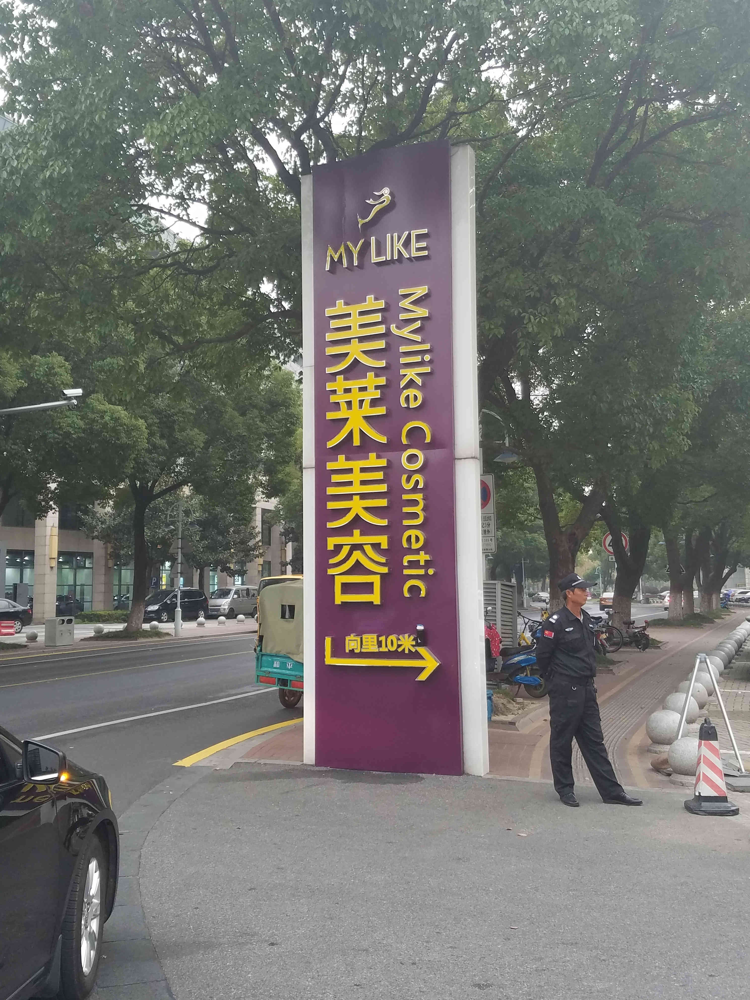

# Return Home

Every good time has to come to an end. We assume most people have to leave by shuttle bus (either to Hongqiao Airport or Pudong International Airport). If you have to arrive at the airport very early(before nearly 7:35 for Hongqiao and 8:35 for Pudong) or very late (after nearly 19:40 for Hongqiao and 20:40 for Pudong), the most sensible ways seems to take a taxi to Suzhou Railway Station, and then from there take the high-speed train to Shanghai, which runs from 5:27 to 22:43, and take also a taxi to your airport. Or go the whole way to the airport by taxi. Note that not every taxi driver is willing to make this long-distance trip (although many of them are happy to do so). Also in this case they may not use the meter to calculate the price. Instead, you have to negotiate the price (around 600 RMB or 100$) with them before leaving.

## By taxi
If you need to take a taxi to the airport directly, the following information may be useful:

- To Hongqiao Airport Terminal 1: Show [this map](dephoto/hongqiao1.pdf) to the driver, and it will cost around 600 RMB and take around 90min.
- To Hongqiao Airport Terminal 2: Show [this map](dephoto/hongqiao2.pdf) to the driver, and it will cost around 600 RMB and take around 90min.
- To Pudong International Airport: Show [this map](dephoto/pudong.pdf) to the driver, and it will cost around 800 RMB and take around 120min.

## By Airport Shuttle Bus

If you plan to take this method, we suggest you to check out at least 6 hours before your flight. 

To take the bus, you should reach Modern Plaza by taxi, with [this map](dephoto/modern-plaza.pdf). The taxi will drive you to the intersection of You An street and Wang Dun road. If you depart from places near the conference center, it may cost around 25 RMB.
At the intersection, you will see a big sign shown as below:

      

Follow the arrow on the picture, you will see Modern Plaza:

      

The ticket counter (shown as below) is the fourth house from right to left in above picture:

      

Entering the house, if you are lucky, you will see a ticket officer. Otherwise, the ticket officer should be working for the coming bus, which stops at the intersection you are coming from. You can find the ticket officer near the bus (the lady as shown below).

      

Then you should show the ticket officer [this note](dephoto/ticket-pu.pdf) and 84 RMB to get a ticket to Pudong International Airport. You can also show the ticket officer [another note](dephoto/ticket-hong.pdf) and 53 RMB to get a ticket to Hongqiao Airport. 

The bus will stop at the intersection, and you should show the driver the note ([this note](dephoto/luggage2.pdf) for Pudong, [another note](dephoto/luggage1.pdf) for Hongqiao) to place your luggage in the proper place. 

It is worthy to note that there are two types of shuttle bus. The only difference between them is that one type may stop at Hongqiao Airport and the other will not. That means some buses will not stop at Hongqiao Airport at all. All buses have at most 2 stops in the whole journey. 
The bus without stopping at Hongqiao Airport will stop at Pudong Airport only, and it's departure times are 7:50, 9:20, 10:40, 12:00, 13:20, 14:40, 16:00, 17:30.

And its counterpart, the bus which may stop at Hongqiao Airport and then stop at Pudong Airport, departs at 6:05, 6:35, 7:10, 8:40, 9:20, 10:00, 11:20, 12:40, 14:00, 15:20, 16:40, 18:10.

Thus if you plan to get off at Hongqaio Airport, you should always take the first stop. And if you want to arrive at Pudong Airport, it is very safe to sit comfortably on the seat until the driver comes to remind you to get off. 

The whole journey will take you around 90min to Hongqiao and around 150min to Pudong. And if your destination is Hongqiao Airport Terminal 2 or Pudong Airport, around 10min walking is needed to reach there.

If you want to reach Terminal 1 of Hongqiao Airport, however, you should refer to the later chapter describing how to reach Terminal 1 from Hongqiao Railway Station, which is near the bus stop at Hongqiao Airport. 

## By train
If you plan to take this method, we suggest you to check out at least 8 hours before your flight.

To reach Suzhou Railway Station, show the taxi driver [this map](dephoto/suzhou-railway.pdf).

There are two railway stations normally used in Shanghai: Hongqiao Railway Station and Shanghai Railway Station. If you plan to take train, we suppose that you want to arrive at the airport as soon as possible. Thus we have designed [the note](dephoto/ticket-shang.pdf) that help you buy the ticket of the most recent time for either railway station in Shanghai. That means you will arrive in Shanghai (at Hongqiao Railway Station or Shanghai Railway Station) as quickly as possible.

There are essentially two options travel from Hongqiao Railway Station to Hongqiao Airport Terminal 2:

- Walk for 10min.
- Take Metro Line 2/10 for 1 stop to Hongqiao Airport Terminal 2.

From Hongqiao Railway Station to Hongqiao Airport Terminal 1:

- Take taxi. It will cost around 30RMB and take about 30min. Use [this map](dephoto/hq1.pdf).
- Take Metro Line 10 to Hongqiao Airport Terminal 1. The whole journey takes around 20min.

From Hongqiao Railway Station to Pudong International Airport:

- Take taxi. It will cost around 250RMB and take about 80min. Use [this map](dephoto/pd.pdf).
- Take Metro Line 2 to Pudong International Airport. The whole journey takes around 110min.
- Take Metro Line 2 to Long Yang Road and then take maglev to the airport. This method may cost 56 RMB and take around 90min.

From Shanghai Railway Station to Hongqiao Airport Terminal 2:

- Take taxi. It will cost around 60 RMB and take about 55min. Use [this map](dephoto/hq2.pdf).
- Take Metro Line 1 to People's Square and then take Metro Line 2 to Hongqiao Airport Terminal 2. The whole journey takes around 50min. 

From Shanghai Railway Station to Hongqiao Airport Terminal 1:

- Take taxi. It will cost around 60 RMB and take about 45min. Use [this map](dephoto/hq1.pdf).
- Take Metro Line 1 to South Shaanxi Road and then take Metro Line 10 to Hongqiao Airport Terminal 1. The whole journey takes around 60min.

From Shanghai Railway Station to Pudong International Airport:

- Take taxi. It will cost around 200RMB and take about 70min. Use [this map](dephoto/pd.pdf).
- Take Metro Line 1 to People's Square and then take Metro Line 2 to Pudong International Airport. The whole journey takes around 80min.
- Take Metro Line 1 to People's Square, then switch to Metro Line 2 to Long Yang Road and then take maglev to the airport. This method may cost 54 RMB and take around 70min.
