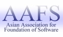
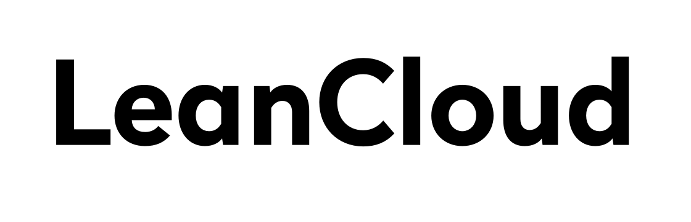
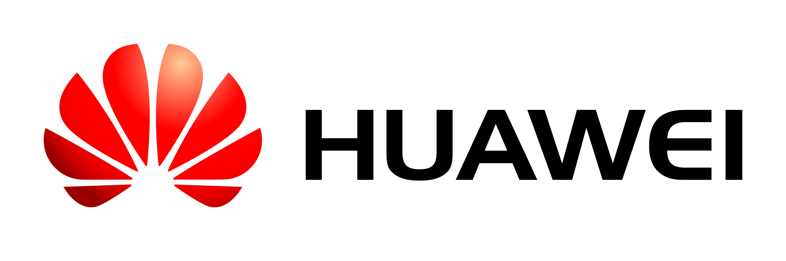

# Welcome to MOSCA 2018

November 27-29, 2017, Suzhou, China

APLAS aims to stimulate programming language research by providing a forum for the presentation of latest results and the exchange of ideas in programming languages and systems. APLAS is based in Asia but is an international forum that serves the worldwide programming languages community.

APLAS is sponsored by the [Asian Association for Foundation of Software (AAFS)](http://www.cs.tsukuba.ac.jp/~kam/AAFS/),
founded by Asian researchers in cooperation with many researchers from Europe and the USA.
Past APLAS symposiums were successfully held in
[Hanoi](https://soict.hust.edu.vn/~aplas2016/) (’16),
[Pohang](http://pl.postech.ac.kr/aplas2015/) (’15),
[Singapore](https://www.math.nagoya-u.ac.jp/~garrigue/APLAS2014/) (’14),
[Melbourne](http://aplas2013.soic.indiana.edu/) (’13),
[Kyoto](http://aplas12.kuis.kyoto-u.ac.jp/index.html) (’12),
[Kenting](http://flolac.iis.sinica.edu.tw/aplas11/) (’11),
[Shanghai](http://basics.sjtu.edu.cn/conference/aplas2010/) (’10),
[Seoul](http://ropas.snu.ac.kr/aplas09/) (’09),
[Bangalore](http://research.microsoft.com/en-us/um/people/grama/APLAS2008/) (’08),
[Singapore](http://flint.cs.yale.edu/aplas2007/) (’07),
[Sydney](http://www.kb.ecei.tohoku.ac.jp/aplas2006/) (’06),
[Tsukuba](http://ropas.snu.ac.kr/2005/aplas/) (’05),
[Taipei](http://www.comp.nus.edu.sg/~aplas/) (’04)
and Beijing (’03)
after three informal workshops. Proceedings of the past symposiums were published in Springer's LNCS.

**New:** This year there'll be a [Student Research Competition (SRC)](SRC.html) associated with the [Poster Session](posters.html).

# Topics

The symposium is devoted to foundational and practical issues in programming languages and systems. Papers are solicited on topics such as

- semantics, logics, foundational theory
- design of languages, type systems, and foundational calculi
- domain-specific languages
- compilers, interpreters, abstract machines
- program derivation, synthesis, and transformation
- program analysis, verification, model-checking
- logic, constraint, probabilistic, and quantum programming
- software security
- concurrency and parallelism
- tools and environments for programming and implementation

Topics are not limited to those discussed in previous symposiums. Papers identifying future directions of programming and those addressing the rapid changes of the underlying computing platforms are especially welcome. Demonstration of systems and tools in the scope of APLAS are welcome to the System and Tool presentations category. Authors concerned about the appropriateness of a topic are welcome to consult with program chair prior to submission.

# Important Dates

- Abstract deadline: Tuesday, June 13, 2017 (firm)
- Paper deadline: Monday, June 19, 2017
- Author response: Wednesday-Friday, July 26-28, 2017
- Author notification: Monday, August 14, 2017
- Camera-ready deadline: Friday, September 1, 2017
- Conference: Monday-Wednesday, November 27-29, 2017

All deadline times are [AoE](https://www.timeanddate.com/worldclock/fixedtime.html?msg=APLAS+2017+Paper+Deadline&iso=20170616T235959&p1=3399).

# Invited Speakers

- [Gilles Barthe](http://software.imdea.org/~gbarthe/index.html), IMDEA. Relational Verification of Higher-Order Probabilistic Programs.
- [Ron Garcia](http://www.cs.ubc.ca/~rxg/), UBC. 	Gradual Enforcement of Program Invariants.
- [Sumit Gulwani](https://www.microsoft.com/en-us/research/people/sumitg/#), Microsoft Research. Programming by Examples: PL meets ML.
- [Naijun Zhan](http://lcs.ios.ac.cn/~znj/), Chinese Academy of Sciences. Synthesizing SystemC Code from Delay Hybrid CSP.

# Sponsors

 &nbsp; &nbsp;
 &nbsp; &nbsp;
 &nbsp; &nbsp;

