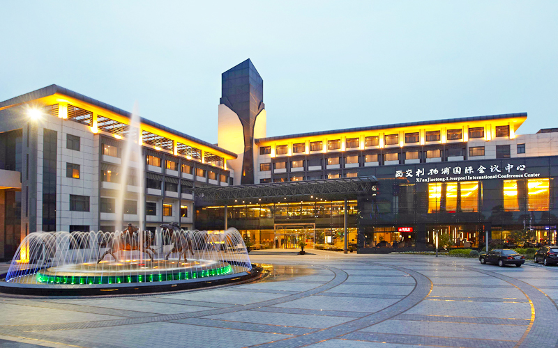
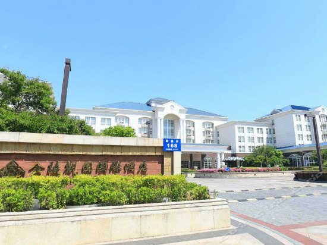
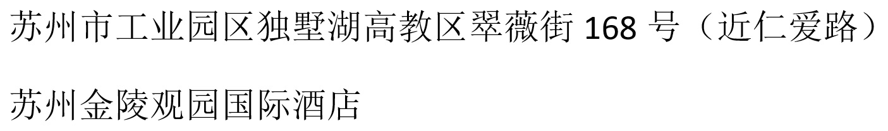
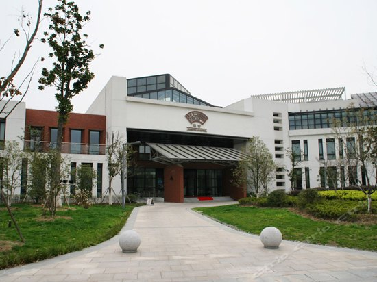
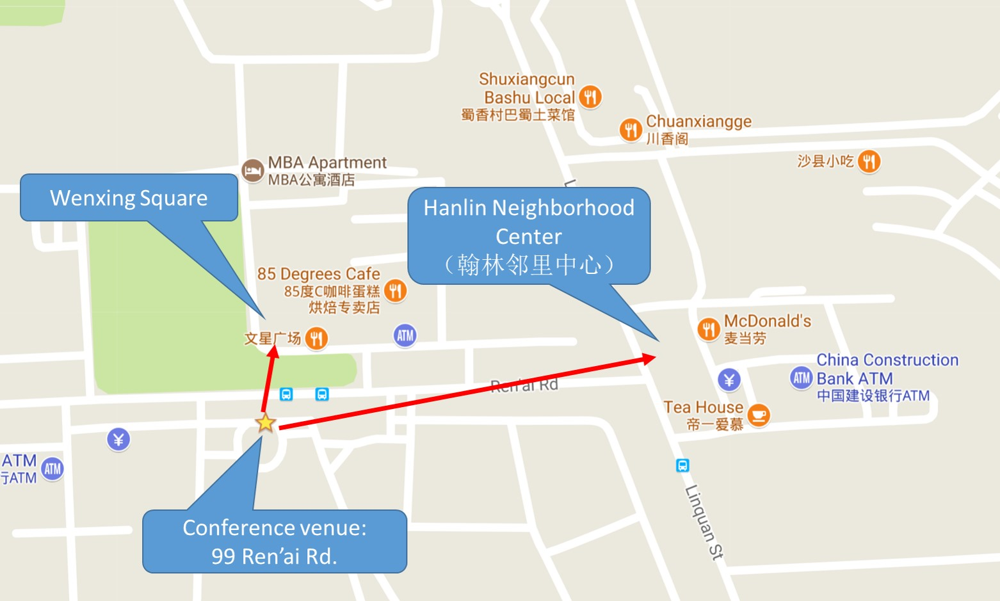

# Local Arrangements

## Conference Venue

The conference hotel is [Xi'an Jiaotong-Liverpool International Conference Center](https://www.google.com/maps/place/99+Ren+Ai+Lu,+Wuzhong+Qu,+Suzhou+Shi,+Jiangsu+Sheng,+China,+215123/@31.2749051,120.7392434,17z/data=!4m5!3m4!1s0x35b3a85b635a2687:0x1b8094ea0803d402!8m2!3d31.275359!4d120.741078).

Address: 99 Ren'ai Road, Industrial Park, Dushu Lake, Suzhou, 215123, China.

Chinese address (which you can print out and show to the taxi drivers):

### Reservation:

You can make reservation yourself at [Ctrip](http://english.ctrip.com/hotels/suzhou-hotel-detail-467241/xi-an-jiaotong-liverpool-international-conference-center/?checkin=2017-11-26&checkout=2017-11-30&searchboxArg=t&hotelname=&display=Xi%E2%80%99an%20Jiaotong-Liverpool%20International%20Conference%20Center&optionId=467241&optionType=Hotel&optionName=Xi%E2%80%99an%20Jiaotong-Liverpool%20International%20Conference%20Center&lat=31.274776&lon=120.74044&city=14&label=XGCX7CeFA0WldlP7fTmIDg&salestype=0&page=1&position=1&minprice=347&mproom=798740&mincurr=CNY&pnotax=&from_page=list&pctoken=a97dedce07c14eac88e3ab7c9d41f37c&abValue=M:33,160616_enh_lrmd:B;&link=title#ctm_ref=lst_n_1_1).

I have also reserved some rooms at the hotel. If you find there are no more rooms online at Ctrip, please let me know (send me email at xinyu.feng@gmail.com) and I can make reservation for you.

## Hotels
In addition to the conference hotel, there are some alternatives you may consider.

### Jinling Guanyuan International Hotel

     
Address: 168 Cuiwei Street, Industrial Park, Dushu Lake, Suzhou, 215123, China

[1.65km from the conference hotel](https://www.google.com/maps/dir/99+Ren'ai+Road,+Suzhou,+Jiangsu,+China/168+Cui+Wei+Jie,+Wuzhong+Qu,+Suzhou+Shi,+Jiangsu+Sheng,+China,+215123/@31.2721374,120.7228131,15z/data=!3m1!4b1!4m13!4m12!1m5!1m1!1s0x35b3a85b635a2687:0x1b8094ea0803d402!2m2!1d120.741078!2d31.275359!1m5!1m1!1s0x35b3a871f9cac271:0x53fbbe71555fe77b!2m2!1d120.722863!2d31.273267). 
5 stops taking the bus 180. 

Reservation at [Ctrip](http://english.ctrip.com/hotels/suzhou-hotel-detail-441546/jinling-guanyuan-international-hotel/?checkin=2017-11-26&checkout=2017-11-30&searchboxArg=t&hotelname=&display=Xi%E2%80%99an%20Jiaotong-Liverpool%20International%20Conference%20Center&optionId=467241&optionType=Hotel&optionName=Xi%E2%80%99an%20Jiaotong-Liverpool%20International%20Conference%20Center&lat=31.274776&lon=120.74044&city=14&label=XGCX7CeFA0WldlP7fTmIDg&salestype=0&page=1&position=3&minprice=450&mproom=2990291&mincurr=CNY&pnotax=&from_page=list&pctoken=469184d84997479e861eda51224554d1&abValue=M:33,160616_enh_lrmd:B;&link=title#ctm_ref=lst_n_1_3).

### [Jingzhai Hotel](http://www.jingzhaihotel.com/)

     
This is a nice hotel and is closer to the conference venue than Jinling Guanyuan, but there are no rooms available on 26th. You can only [reserve rooms](http://english.ctrip.com/hotels/suzhou-hotel-detail-1458397/jingzhai-hotel/?checkin=2017-11-27&checkout=2017-11-30&searchboxArg=t&hotelname=&display=Xi%E2%80%99an%20Jiaotong-Liverpool%20International%20Conference%20Center&optionId=467241&optionType=Hotel&optionName=Xi%E2%80%99an%20Jiaotong-Liverpool%20International%20Conference%20Center&lat=31.274776&lon=120.74044&city=14&label=XGCX7CeFA0WldlP7fTmIDg&salestype=0&page=1&position=2&minprice=357&mproom=20266937&mincurr=CNY&pnotax=&from_page=list&pctoken=09ab225eacf44cec8ae2fc1144a1baf8&abValue=M:33,160616_enh_lrmd:B;&link=title#ctm_ref=lst_n_1_2) from 27th to 30th.

Address: 158 Ren'ai Road, Industrial Park, Dushu Lake, Suzhou, 215123, China 

  
[0.81km from the conference hotel](https://www.google.com/maps/dir/158+Ren+Ai+Lu,+Wuzhong+Qu,+Suzhou+Shi,+Jiangsu+Sheng,+China/99+Ren+Ai+Lu,+Wuzhong+Qu,+Suzhou+Shi,+Jiangsu+Sheng,+China/@31.2756682,120.7333051,16z/data=!3m1!4b1!4m13!4m12!1m5!1m1!1s0x35b3a867f180088d:0x879bee13135ac2fa!2m2!1d120.734453!2d31.276184!1m5!1m1!1s0x35b3a85b635a2687:0x1b8094ea0803d402!2m2!1d120.741078!2d31.275359). 2 stops taking the buses 178, 146 or 180.

Reservation at [Ctrip](http://english.ctrip.com/hotels/suzhou-hotel-detail-1458397/jingzhai-hotel/?checkin=2017-11-27&checkout=2017-11-30&searchboxArg=t&hotelname=&display=Xi%E2%80%99an%20Jiaotong-Liverpool%20International%20Conference%20Center&optionId=467241&optionType=Hotel&optionName=Xi%E2%80%99an%20Jiaotong-Liverpool%20International%20Conference%20Center&lat=31.274776&lon=120.74044&city=14&label=XGCX7CeFA0WldlP7fTmIDg&salestype=0&page=1&position=2&minprice=357&mproom=20266937&mincurr=CNY&pnotax=&from_page=list&pctoken=09ab225eacf44cec8ae2fc1144a1baf8&abValue=M:33,160616_enh_lrmd:B;&link=title#ctm_ref=lst_n_1_2) (only available from 27th to 30th). 

### More options

See [the list here](http://english.ctrip.com/hotels/list?city=14&checkin=11-26-2017&checkout=11-30-2017&hotelname=&searchboxArg=t&optionId=467241&optionType=Hotel&optionName=Xi%E2%80%99an%20Jiaotong-Liverpool%20International%20Conference%20Center&lat=31.274776&lon=120.74044&sort=dis0&display=Xi%E2%80%99an%20Jiaotong-Liverpool%20International%20Conference%20Center&markland=&label=XGCX7CeFA0WldlP7fTmIDg).

There are some more economic hotels around the conference hotel at the Wenxing Square and the Hanlin Neighborhood Center within walking distance (see the map below). You cannot make reservation online. They are very close to the conference hotel and the rates are much lower. The problem is the staff do not speak English, and the hotels may not even have English names (maybe a bit difficult to locate). Let me know if you want me to help make reservation in one of those hotels.

There are also many restaurants, bakery stores, coffee shops and convenience stores at Wenxing Square and the Hanlin Neighborhood Center (see the map above). 

## More Information about Suzhou

* [Suzhou Travel Guide](https://www.travelchinaguide.com/cityguides/suzhou.htm).
* [What's on in Suzhou](http://www.whatsoninsuzhou.com.cn/)
* [Suzhou City Guide](http://www.cityweekend.com.cn/suzhou)
* [Website of the Suzhou Government](http://english.suzhou.gov.cn/)
